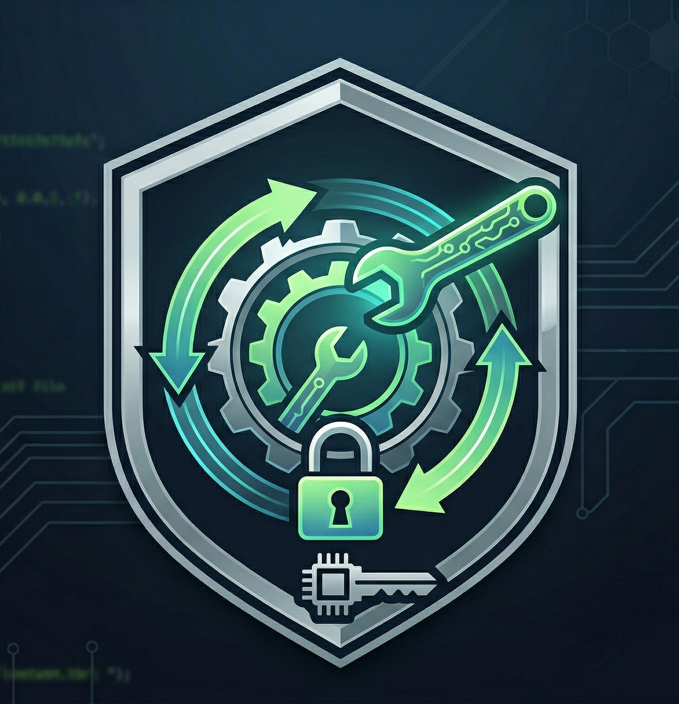

Analyse de binaire : Reverse Engineering avec Ghidra

> [!NOTE]
> **Note d'éthique** : Ce writeup est volontairement anonymisé et les données sensibles (nom du challenge, mot de passe réel) ont été modifiées. Cette démarche vise à démontrer une méthodologie de résolution sans dégrader l'expérience des autres utilisateurs, conformément aux règles de la plateforme hébergeant l'exercice.

Informations de la Cible

    Nom : Basic Crackme (Anonymized)

    Difficulté : Easy

    Outils : Ghidra


1. Introduction

L'objectif de ce challenge est de retrouver le mot de passe attendu par un binaire ELF 64-bit. Pour cela, nous utilisons l'outil de rétro-ingénierie Ghidra afin de décompiler le code machine en code C lisible.


2. Analyse statique (Ghidra)

Après avoir importé le binaire, nous nous dirigeons vers la fonction `main`. Le code décompilé présente une série de vérifications imbriquées sur une chaîne de caractères saisie par l'utilisateur.

Compréhension de la Stack (Pile) :

Le décompileur affiche plusieurs variables de type `char` (ex: `local_54`, `cStack80`). Bien qu'elles apparaissent comme des variables distinctes, elles sont en réalité adjacentes en mémoire. En effectuant un "Retype Variable" sur la première variable vers un tableau `char[19]`, le code devient immédiatement plus clair.

Voici le code décompilé (Anonymized) :

```c
undefined4 main(void)
{
  size_t sVar1;
  int local_58;
  char local_54 [4];
  char cStack80;
  char cStack79;
  char cStack78;
  char cStack77;
  char acStack76 [9];
  char cStack67;
  char cStack66;
  undefined4 local_c;
 
  puts("--- Internal Crackme Login ---");
  puts("Enter password please:");
  fgets(local_54, 0x40, stdin);
  
  sVar1 = strlen(local_54);
  // Nettoyage du newline
  *(undefined *)((long)&local_58 + sVar1 + 3) = 0; 
  
  sVar1 = strlen(local_54);
  if (sVar1 == 0x13) { // Longueur : 19
    local_58 = 8; // Indices 8
    while (local_58 < 0x11) { // à 16
      if (local_54[local_58] != 'i') {
        fail();
        return 0;
      }
      local_58 = local_58 + 1;
    }
    if (cStack66 == 'n') {
      if (cStack67 == 'o') {
        if (cStack77 == 'i') {
          if ((local_54[2] == 'o') && (cStack78 == 't')) {
            if (local_54[0] == 'p') {
              if (local_54[1] == 'r') {
                if (local_54[3] == 't') {
                  if (cStack80 == 'e') {
                    if (cStack79 == 'c') {
                      success();
                      return local_c;
                    }
                    fail();
                  }
                  else { fail(); }
                }
                else { fail(); }
              }
              else { fail(); }
            }
            else { fail(); }
          }
          else { fail(); }
        }
        else { fail(); }
      }
      else { fail(); }
    }
    else { fail(); }
  }
  else { fail(); }
  return 0;
}
```


3. Décomposition de l'algorithme

### Étape A : Vérification de la longueur
Le programme commence par mesurer la longueur de la saisie avec `strlen`.
```c
if (sVar1 == 0x13) { ... }
```
`0x13` en hexadécimal correspond à **19** en décimal. Le mot de passe doit donc faire exactement 19 caractères.

### Étape B : La boucle de répétition
Une boucle `while` parcourt une section spécifique du mot de passe :
```c
for (local_58 = 8; local_58 < 0x11; local_58 = local_58 + 1) {
    if (password[local_58] != 'i') { ... }
}
```
L'indice commence à 8 et s'arrête avant 17 (`0x11`). Cela signifie que les caractères aux index **8, 9, 10, 11, 12, 13, 14, 15 et 16** doivent tous être la lettre **'i'**.

### Étape C : Vérifications unitaires
Le reste du code compare chaque index restant à un caractère spécifique. En suivant les conditions `if` imbriquées, nous pouvons reconstruire la chaîne :
- `local_54[0] = 'p'`
- `local_54[1] = 'r'`
- `local_54[2] = 'o'`
- `local_54[3] = 't'`
- `cStack80 = 'e'`
- `cStack79 = 'c'`
- `cStack78 = 't'`
- `cStack77 = 'i'`
- `cStack67 = 'o'`
- `cStack66 = 'n'`


4. Reconstruction du secret

En assemblant les pièces du puzzle (les caractères isolés et la boucle centrale), nous obtenons la structure suivante :

| Index | 0-3 | 4-7 | 8-16 | 17 | 18 |
| :--- | :--- | :--- | :--- | :--- | :--- |
| **Valeur** | p r o t | e c t i | i i i i i i i i i | o | n |

**Mot de passe final :** `protectiiiiiiiiiiion`
